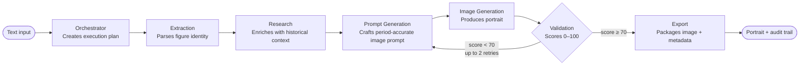

# ChronoCanvas

**Make history visible.**

ChronoCanvas generates historically accurate, period-faithful portraits of historical figures from a text description — running entirely on your own hardware.

---

## Why it exists

History is text-heavy. Textbooks, Wikipedia articles, and academic papers describe historical figures in detail, but rarely show them. For educators building curriculum, historians communicating research, and content creators telling historical stories, the gap between *knowing* about a person and *seeing* them is significant.

ChronoCanvas was built to close that gap. Given a description — a name, an era, a place — it researches the figure, constructs a historically grounded visual prompt, generates a period-accurate portrait, and validates the result for anachronisms. The entire pipeline runs locally: no image data leaves your machine, no cloud image API is required, and the system works without an internet connection if you configure a local LLM.

---

## What it does

**Input:** a text description — as simple as a name, or as detailed as a paragraph.

> *"Aryabhata, Indian mathematician and astronomer, Gupta period, 5th century CE"*

**Output:** a historically researched, period-accurate portrait — with a full audit trail of every decision the system made, every source consulted, and every token spent to get there.

---

## Key features

- **Local-first, private by design** — image generation runs on your hardware; cloud LLMs are optional and replaceable with Ollama
- **Historically grounded** — a dedicated Research agent enriches every generation with verified historical context before any image is produced
- **Automated accuracy validation** — every portrait is scored 0–100 against historical criteria; scores below 70 trigger automatic retry with a corrected prompt
- **Timeline explorer** — browse 500 BCE to 1700 CE on an interactive slider with curated figures, weighted toward the Indian subcontinent
- **Facial compositing** — upload a reference photo; FaceFusion replaces the generated face while preserving the historical costume and setting
- **Full audit trail** — every LLM call (prompt, tokens, cost, latency) is logged and browsable per generation
- **100+ seed figures** — curated across Ancient through Modern eras; add custom figures via the UI or CLI
- **7-agent AI pipeline** — each stage has a defined role, structured output contract, and an independently configurable LLM provider

---

## Generation flow



---

## Getting started

**Prerequisites:** Docker, Docker Compose, 8 GB RAM minimum.

```bash
# 1. Clone the repository
git clone https://github.com/your-org/chrono-canvas.git
cd chrono-canvas

# 2. Configure your environment
cp .env.example .env
# Edit .env — API keys are optional; Ollama-only mode works for all tasks

# 3. Start all services
make dev

# 4. Load the seed figures
make seed

# 5. Open the UI
open http://localhost:3000
```

The first run downloads model weights and Docker images — allow a few minutes. Subsequent starts are fast.

> **No cloud required.** If you set `DEFAULT_LLM_PROVIDER=ollama` in `.env` and run Ollama locally, ChronoCanvas operates entirely offline.

---

## The UI at a glance

| Page | What you do here |
|---|---|
| **Timeline** | Browse figures by era on a 500 BCE – 1700 CE interactive slider |
| **Generate** | Describe a figure → watch the seven agents work in real time |
| **Audit** | Inspect every LLM call, prompt, token count, cost, and validation score |
| **Validate** | Review accuracy scores, anachronism flags, and retry history |
| **Figures** | Search and manage the figures library; add custom entries |
| **Export** | Download portraits and structured JSON metadata |
| **Admin** | Agent health, LLM provider status, and cost tracking |

---

## The pipeline (overview)

ChronoCanvas uses a LangGraph state machine. Seven agents run in sequence; each has a well-defined input contract, a structured output, and an independently configurable LLM provider. The validation agent can loop the pipeline back to prompt generation if the portrait fails its accuracy threshold.

The system supports Claude, OpenAI, and Ollama, with per-task routing and an automatic fallback chain.

---

## Documentation

| Document | Contents |
|---|---|
| [TECHNICAL.md](TECHNICAL.md) | Architecture, agent reference, full configuration guide |
| [docs/api.md](docs/api.md) | REST API and WebSocket reference |
| [docs/development.md](docs/development.md) | Development setup, project structure, extension guide |

---

## License

See [LICENSE](LICENSE).
