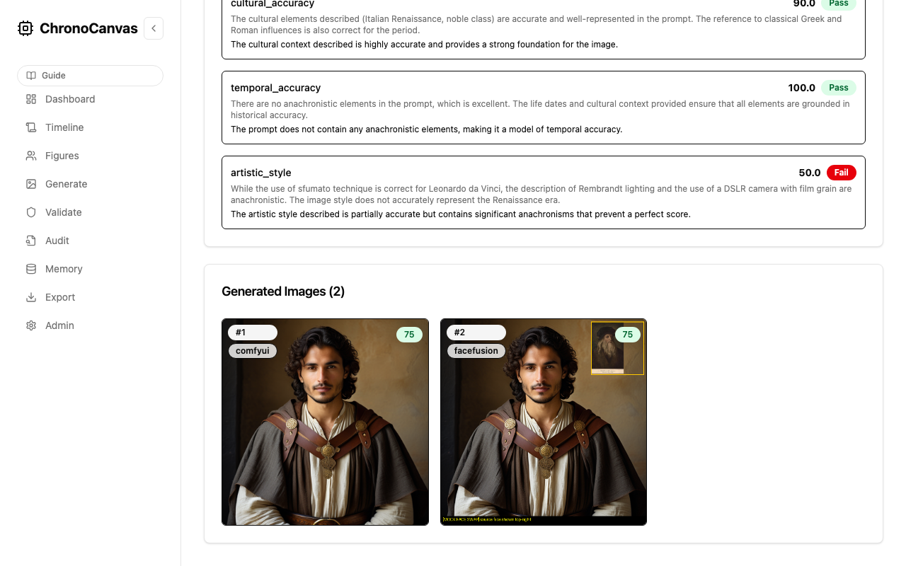
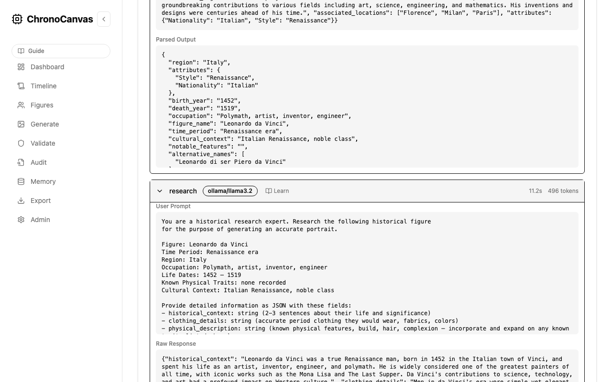
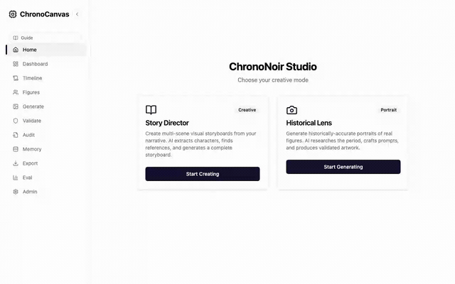

# ChronoCanvas

**An auditable multimodal agent pipeline — applied to historical portrait generation.**

ChronoCanvas is a focused case study in building traceable, evaluable AI systems. It orchestrates LLM research, image generation, and heuristic validation into a 9-node pipeline with full cost/latency observability, provider routing, and automated retry loops. The historical portrait domain is simply the testbed; the reusable patterns are inspection-friendly AI pipelines that you can trust in higher-stakes environments. Everything runs on your own hardware.

### See it working

<p align="center">
  
</p>

<p align="center">
  <em>A generated portrait of Leonardo da Vinci — with researched Renaissance-era clothing, validated against 4 historical criteria, and a full audit trail of every LLM call.</em>
</p>

<details>
<summary>Audit trail and pipeline view</summary>



</details>

<!-- Optional: uncomment when a GIF is available
<details>
<summary>Pipeline run (GIF)</summary>



</details>
-->

### Who this is for

- Engineering leaders evaluating whether auditable agent workflows are feasible on current tooling
- Staff-plus ICs who need a concrete reference implementation for LangGraph-based pipelines with validation and retries
- Recruiters or hiring managers who need one glance proof of system-level thinking (skip directly to [Learn from this repo](#learn-from-this-repo))

> A serious prototype and engineering sandbox, not a historical source-of-truth engine. The majority of this codebase was built with [Claude Code](https://claude.ai/claude-code).

---

## Project status

**Maturity: prototype / research system**

- The end-to-end pipeline works: text input → researched context → generated portrait → validation → export
- Validation uses LLM-based heuristic scoring — it catches obvious anachronisms but does not guarantee historical fact-checking
- Face compositing requires FaceFusion running separately (optional)
- Image generation requires ComfyUI with SDXL/FLUX checkpoints, or runs in mock mode for development
- Designed for local / trusted-network deployment — no authentication layer
- Known rough edges: some seed data is placeholder-quality; offline mode coverage varies by provider

### What works today

- 9-node LangGraph pipeline with per-node LLM provider routing
- Real-time progress streaming via WebSocket + Redis pub/sub
- Full audit trail: every LLM call logged with prompts, tokens, cost, latency
- Automated validation with configurable category weights and retry loops
- 100+ seed figures across 12 historical periods
- Timeline explorer, generation UI, audit viewer, admin dashboard
- Docker Compose dev stack (PostgreSQL, Redis, API, frontend)

---

## Why it exists

Most AI demos hide what happened between input and output. ChronoCanvas was built to explore the opposite: what does it look like when every LLM call, every routing decision, every validation score, and every retry is logged and browsable? The historical portrait domain provides a natural test case — it requires multi-step reasoning (research → prompt crafting → generation → validation), spans multiple modalities (text → image), and has an inherent quality bar (does the output look plausible for the era?).

The transferable patterns — agent orchestration with LangGraph, per-task LLM provider routing, cost/latency tracing, automated evaluation with retry loops, real-time progress streaming — apply to any domain where AI pipelines need to be inspectable rather than magical.

---

## How it works

**Input:** a text description — as simple as a name, or as detailed as a paragraph.

> *"Aryabhata, Indian mathematician and astronomer, Gupta period, 5th century CE"*

**Output:** a generated portrait with a full audit trail of every decision the system made, every source consulted, and every token spent.

### Pipeline


Nine pipeline nodes, each with a defined role and independently configurable LLM provider. See [TECHNICAL.md](TECHNICAL.md) for the full node reference.

---

## Key capabilities

- **Local-first** — image generation runs on your hardware; cloud LLMs are optional and replaceable with Ollama
- **Historically informed** — a dedicated research node enriches every generation with contextual information before any image is produced
- **Best-effort validation** — portraits are scored 0–100 against configurable criteria; low scores trigger automatic retry with a corrected prompt
- **Full audit trail** — every LLM call (prompt, tokens, cost, latency) is logged and browsable per generation
- **Facial compositing** — upload a reference photo; FaceFusion composites the face while preserving the historical costume and setting
- **Timeline explorer** — browse historical periods on an interactive slider with curated figures
- **100+ seed figures** — curated across Ancient through Modern eras; add custom figures via the UI

---

## Getting started

**Prerequisites:** Docker, Docker Compose, 8 GB RAM minimum.

```bash
# Clone the repository
git clone https://github.com/riyer-pitsoftware/chrono-canvas.git
cd chrono-canvas

# Configure environment
cp .env.example .env
# Edit .env — API keys are optional; Ollama-only mode works for all LLM tasks

# Start all services
make dev

# Run database migrations and seed data
make migrate
make seed

# Open the UI
open http://localhost:3000
```

The first run downloads model weights and Docker images — allow a few minutes.

> **No cloud required.** Set `DEFAULT_LLM_PROVIDER=ollama` in `.env` and run Ollama locally for fully offline LLM operation. Image generation requires ComfyUI running locally, or use `IMAGE_PROVIDER=mock` for development.

---

## Deployment modes

| Mode | LLM provider | Image generation | Internet required | Notes |
|---|---|---|---|---|
| **Full cloud** | Claude + OpenAI | ComfyUI (local) | Yes (LLM APIs) | Best output quality; requires API keys |
| **Hybrid** | Ollama (local) + Claude (research only) | ComfyUI (local) | Yes (Anthropic API) | Reduces cost; only research node uses cloud |
| **Fully offline** | Ollama | ComfyUI (local) | No | All processing on your hardware; quality depends on local model |
| **Development** | Ollama or cloud | Mock (no GPU) | Optional | Fast iteration; generates placeholder images |

Face search (SerpAPI) requires internet regardless of mode. Facial compositing (FaceFusion) always runs locally.

---

## Learn from this repo

ChronoCanvas is designed to be readable as a systems case study. Here are good starting points depending on your interest:

**Agent orchestration and LangGraph:**
- [`backend/src/chronocanvas/agents/graph.py`](backend/src/chronocanvas/agents/graph.py) — graph definition, node wiring, conditional edges
- [`backend/src/chronocanvas/agents/state.py`](backend/src/chronocanvas/agents/state.py) — the shared state schema flowing between nodes
- [`backend/src/chronocanvas/agents/decisions.py`](backend/src/chronocanvas/agents/decisions.py) — conditional routing logic (validation retry loop)

**LLM provider routing and cost tracking:**
- [`backend/src/chronocanvas/llm/router.py`](backend/src/chronocanvas/llm/router.py) — per-task provider assignment with fallback chain
- [`backend/src/chronocanvas/llm/providers/`](backend/src/chronocanvas/llm/providers/) — pluggable provider implementations (Ollama, Claude, OpenAI)

**Audit trail and observability:**
- [`backend/src/chronocanvas/services/runner.py`](backend/src/chronocanvas/services/runner.py) — pipeline execution with LLM call logging
- [`backend/src/chronocanvas/api/routes/admin.py`](backend/src/chronocanvas/api/routes/admin.py) — validation rules, review queue

**Real-time streaming:**
- [`backend/src/chronocanvas/services/progress.py`](backend/src/chronocanvas/services/progress.py) — Redis pub/sub progress publisher
- [`frontend/src/api/hooks/`](frontend/src/api/hooks/) — WebSocket subscription and React Query integration

**Local deployment and Docker:**
- [`docker-compose.dev.yml`](docker-compose.dev.yml) — full dev stack definition
- [`docker/`](docker/) — service-specific Dockerfiles and configs
- [`docs/architecture-invariants.md`](docs/architecture-invariants.md) — rules that keep the system coherent

---

## Documentation

| Document | Contents |
|---|---|
| [TECHNICAL.md](TECHNICAL.md) | Architecture, node reference, full configuration guide |
| [docs/api.md](docs/api.md) | REST API and WebSocket reference |
| [docs/development.md](docs/development.md) | Development setup, project structure, contribution guide |
| [docs/architecture-invariants.md](docs/architecture-invariants.md) | Non-negotiable architectural rules |
| [notes/artifact-positioning-template.md](notes/artifact-positioning-template.md) | Messaging template to keep artifacts focused on one job |

---

## Known limitations

- **Not historically accurate** — outputs are informed by LLM research, not verified by historians. Treat generated portraits as plausible illustrations, not authoritative depictions.
- **Validation is heuristic** — the scoring system uses LLM judgment, not ground-truth benchmarks. It catches obvious errors but has blind spots.
- **No authentication** — designed for trusted local deployment only. Do not expose to the public internet without adding an auth layer.
- **Provider-dependent quality** — output quality varies significantly between LLM and image generation providers.
- **Limited offline testing** — Ollama-only mode works for LLM tasks but hasn't been exhaustively tested across all edge cases.

---

## License

MIT — see [LICENSE](LICENSE).
