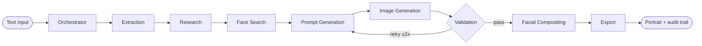
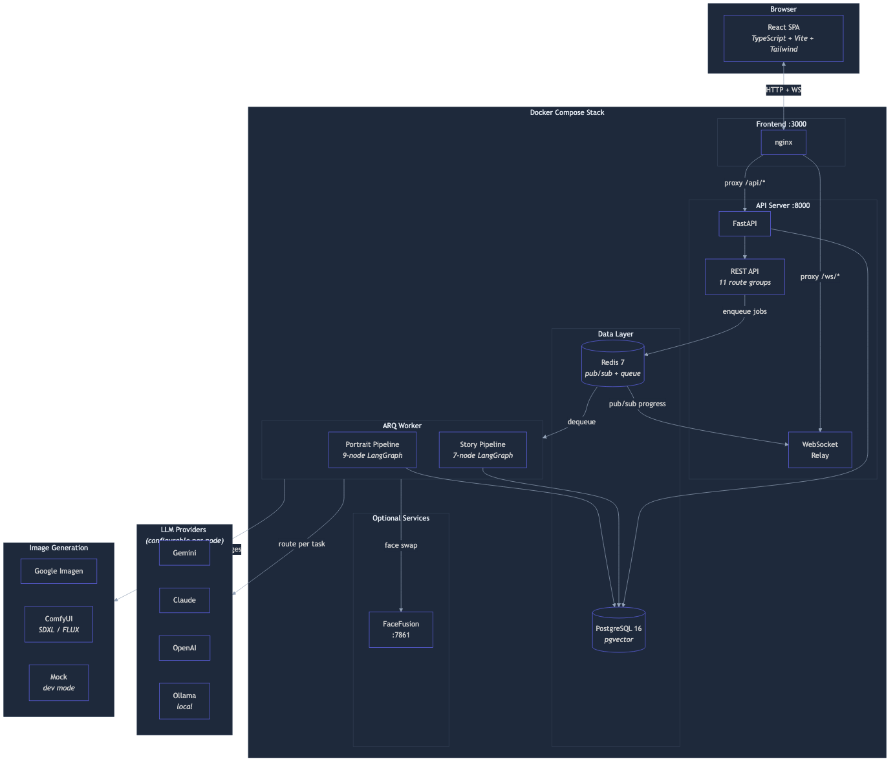

# ChronoCanvas

**An auditable multimodal agent pipeline — applied to historical portrait generation.**

ChronoCanvas is a focused case study in building traceable, evaluable AI systems. It orchestrates LLM research, image generation, and heuristic validation into a 9-node pipeline with full cost/latency observability, provider routing, and automated retry loops. The historical portrait domain is simply the testbed; the reusable patterns are inspection-friendly AI pipelines that you can trust in higher-stakes environments.

<p align="center">
  
</p>

<p align="center">
  <em>A generated portrait of Leonardo da Vinci — with researched Renaissance-era clothing, validated against 4 historical criteria, and a full audit trail of every LLM call.</em>
</p>

<details>
<summary>Audit trail and pipeline view</summary>


</details>

<details>
<summary>Pipeline run (GIF)</summary>


</details>

<!-- Demo video — uncomment when uploaded -->
<!-- <details>
<summary>Demo video (~3 min)</summary>

[](YOUR_VIDEO_URL_HERE)

Record with: `node scripts/record-demo-video.mjs`

</details> -->

---

## Quick start

**Prerequisites:** Docker and Docker Compose v2. No API keys required — runs fully offline with Ollama.

```bash
git clone https://github.com/riyer-pitsoftware/chrono-canvas.git
cd chrono-canvas
make quickstart
```

That's it. The script checks prerequisites, creates `.env` with safe defaults, builds all containers, runs migrations, loads seed data, and waits for health. When it finishes:

| Service | URL |
|---------|-----|
| **UI** | [http://localhost:3000](http://localhost:3000) |
| **API** | [http://localhost:8000/api/health](http://localhost:8000/api/health) |
| **Swagger docs** | [http://localhost:8000/docs](http://localhost:8000/docs) |

Verify the cold start with `make smoke-test` — runs 8 checks against the live stack.

> **First run takes a few minutes** to download Docker images and build containers. Subsequent starts are fast thanks to Docker layer caching.

---

## Hackathon: Creative Storyteller with Gemini

**Category:** Creative Storyteller with Gemini interleaved output

ChronoCanvas uses **Gemini 2.5 Flash multimodal** to power an end-to-end story generation pipeline: research, narration, image generation, and storyboard coherence review — all orchestrated as a LangGraph agent with a full audit trail.

### GCP services used

| GCP Service | Role in ChronoCanvas |
|---|---|
| **Gemini** (via google-genai SDK) | All LLM calls in Story Director mode — scene narration, dialogue, panel layout |
| **Imagen** (via google-genai SDK) | Image generation for every story panel and portrait |
| **Gemini multimodal** | Storyboard coherence review — evaluates character consistency and art style across panels using images + text |
| **Cloud Run** | Managed deployment of API, worker, and frontend services |
| **Cloud SQL** (PostgreSQL) | Persistent storage for generations, audit logs, and validation results |
| **Memorystore** (Redis) | Real-time streaming via pub/sub + ARQ job queue |

### SDK usage

All Gemini and Imagen calls go through the **`google-genai` Python SDK** (`google.genai.Client`). No REST wrappers — direct SDK integration in:
- `backend/src/chronocanvas/llm/providers/gemini.py` — Gemini LLM provider
- `backend/src/chronocanvas/imaging/imagen_client.py` — Imagen image generation
- `backend/src/chronocanvas/agents/nodes/storyboard_coherence.py` — Gemini multimodal coherence check

### Verify it yourself

1. **Run a generation** and open the audit trail in the UI — every LLM call shows `provider: "gemini"` with token counts and cost.
2. **Check the database directly:** `docker exec chrono-canvas-db-1 psql -U chronocanvas -c "SELECT provider, model, token_count, cost FROM audit_logs ORDER BY created_at DESC LIMIT 10;"` — confirms Gemini is the active provider.
3. **Run the smoke test:** `make smoke-test` — verifies the full pipeline end-to-end including LLM calls, image generation, and audit logging.

---

## What it does

| # | Pipeline node | Default LLM | Role |
|---|---|---|---|
| 1 | Orchestrator | Ollama | Reads input, creates execution plan |
| 2 | Extraction | Ollama | Parses free-text into structured figure data |
| 3 | Research | Claude | Enriches with historical context (streaming) |
| 4 | Face Search | SerpAPI | Finds a reference face image |
| 5 | Prompt Generation | Claude | Builds a period-informed image prompt (streaming) |
| 6 | Image Generation | ComfyUI/Mock | Produces the portrait |
| 7 | Validation | Ollama | Scores 0-100 for historical plausibility; retries on failure |
| 8 | Facial Compositing | FaceFusion | Composites uploaded face onto portrait |
| 9 | Export | — | Packages final PNG + metadata |



Every LLM call is logged with prompts, tokens, cost, and latency — browsable in the audit viewer.

---

## Key capabilities

- **Local-first** — image generation runs on your hardware; cloud LLMs are optional and replaceable with Ollama
- **Historically informed** — a dedicated research node enriches every generation with contextual information before any image is produced
- **Best-effort validation** — portraits are scored 0-100 against configurable criteria; low scores trigger automatic retry with a corrected prompt
- **Full audit trail** — every LLM call (prompt, tokens, cost, latency) is logged and browsable per generation
- **Facial compositing** — upload a reference photo; FaceFusion composites the face while preserving the historical costume and setting
- **Timeline explorer** — browse historical periods on an interactive slider with curated figures
- **100+ seed figures** — curated across Ancient through Modern eras; add custom figures via the UI
- **Real-time streaming** — WebSocket + Redis pub/sub pushes node progress and LLM token streams to the UI live
- **Admin dashboard** — configure validation weights, review queue for failed generations, system overview

---

## Deployment modes

| Mode | LLM provider | Image generation | Internet required | Notes |
|---|---|---|---|---|
| **Full cloud** | Claude + OpenAI | ComfyUI (local) | Yes (LLM APIs) | Best output quality; requires API keys |
| **Hybrid** | Ollama (local) + Claude (research only) | ComfyUI (local) | Yes (Anthropic API) | Reduces cost; only research node uses cloud |
| **Fully offline** | Ollama | ComfyUI (local) | No | All processing on your hardware |
| **Development** | Ollama or cloud | Mock (no GPU) | Optional | Fast iteration; generates placeholder images |
| **Cloud Run** | Gemini | Imagen | Yes | Managed GCP deployment; ~$144/mo |
| **GKE** | Configurable | Configurable | Yes | Kubernetes deployment with in-cluster Postgres |

---

## Architecture

<p align="center">
  
</p>

| Component | Technology | Role |
|---|---|---|
| Frontend | React 18 + TypeScript + Vite + Tailwind | Web UI with timeline explorer, audit viewer, admin |
| Backend | FastAPI + LangGraph + SQLAlchemy (asyncpg) | API server + agent orchestration |
| Database | PostgreSQL 16 (pgvector) | Persistent storage + research vector cache |
| Cache/Queue | Redis 7 | Pub/sub streaming + ARQ job queue |
| Image gen | Mock / ComfyUI / Imagen | Portrait generation backend |
| CLI | Typer + Rich | Command-line automation |

Architecture diagrams (Mermaid source + rendered PNGs) are versioned in [`docs/diagrams/`](docs/diagrams/) — system architecture, portrait pipeline, story pipeline, and data model.

---

## Learn from this repo

ChronoCanvas is designed to be readable as a systems case study. Here are good starting points depending on your interest:

**Agent orchestration and LangGraph:**
- [`agents/graph.py`](backend/src/chronocanvas/agents/graph.py) — graph definition, node wiring, conditional edges
- [`agents/state.py`](backend/src/chronocanvas/agents/state.py) — the shared state schema flowing between nodes
- [`agents/decisions.py`](backend/src/chronocanvas/agents/decisions.py) — conditional routing logic (validation retry loop)

**LLM provider routing and cost tracking:**
- [`llm/router.py`](backend/src/chronocanvas/llm/router.py) — per-task provider assignment with fallback chain
- [`llm/providers/`](backend/src/chronocanvas/llm/providers/) — pluggable provider implementations (Ollama, Claude, OpenAI, Gemini)

**Audit trail and observability:**
- [`services/runner.py`](backend/src/chronocanvas/services/runner.py) — pipeline execution with LLM call logging
- [`api/routes/admin.py`](backend/src/chronocanvas/api/routes/admin.py) — validation rules, review queue

**Real-time streaming:**
- [`services/progress.py`](backend/src/chronocanvas/services/progress.py) — Redis pub/sub progress publisher
- [`api/hooks/`](frontend/src/api/hooks/) — WebSocket subscription and React Query integration

---

## Project commands

```bash
make quickstart     # One-command cold start (build + migrate + seed + health check)
make smoke-test     # Verify the running stack (8 checks)
make dev            # Start services (if already built)
make down           # Stop all services
make fresh          # Full reset (wipe data + rebuild + reseed)
make logs           # Stream all service logs
make health         # Quick health check
make test           # Run backend + CLI tests
make lint           # Lint backend + frontend
```

---

## Documentation

| Document | Contents |
|---|---|
| [TECHNICAL.md](TECHNICAL.md) | Architecture, node reference, full configuration guide |
| [docs/api.md](docs/api.md) | REST API and WebSocket reference |
| [docs/development.md](docs/development.md) | Development setup, project structure, contribution guide |
| [docs/architecture-invariants.md](docs/architecture-invariants.md) | Non-negotiable architectural rules |
| [deploy/cloudrun/README.md](deploy/cloudrun/README.md) | Cloud Run deployment guide |
| [deploy/gke/README.md](deploy/gke/README.md) | GKE deployment guide |

---

## Who this is for

- Engineering leaders evaluating whether auditable agent workflows are feasible on current tooling
- Staff-plus ICs who need a concrete reference implementation for LangGraph-based pipelines with validation and retries
- Recruiters or hiring managers who need one-glance proof of system-level thinking

> A serious prototype and engineering sandbox, not a historical source-of-truth engine. The majority of this codebase was built with [Claude Code](https://claude.ai/claude-code).

---

## Known limitations

- **Not historically accurate** — outputs are informed by LLM research, not verified by historians. Treat generated portraits as plausible illustrations, not authoritative depictions.
- **Validation is heuristic** — the scoring system uses LLM judgment, not ground-truth benchmarks. It catches obvious errors but has blind spots.
- **No authentication** — designed for trusted local deployment only. Do not expose to the public internet without adding an auth layer.
- **Provider-dependent quality** — output quality varies significantly between LLM and image generation providers.

---

## License

MIT — see [LICENSE](LICENSE).
